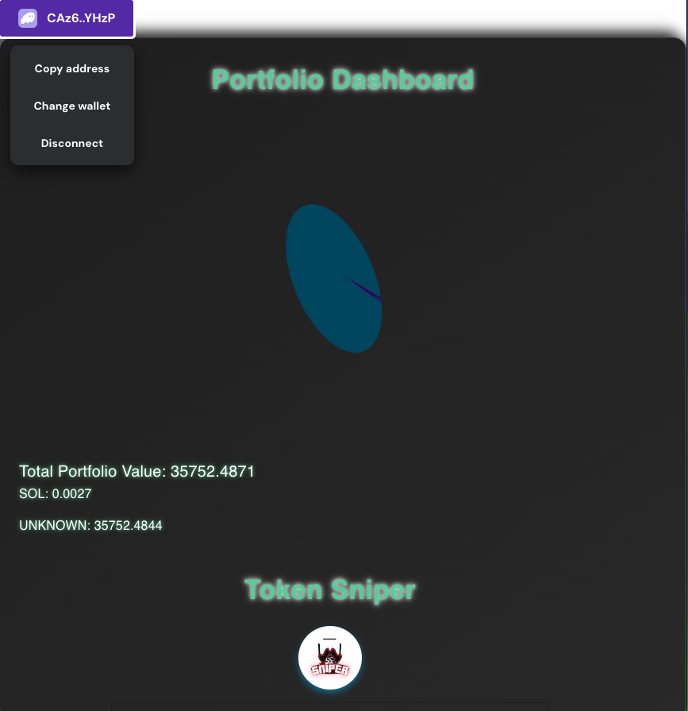
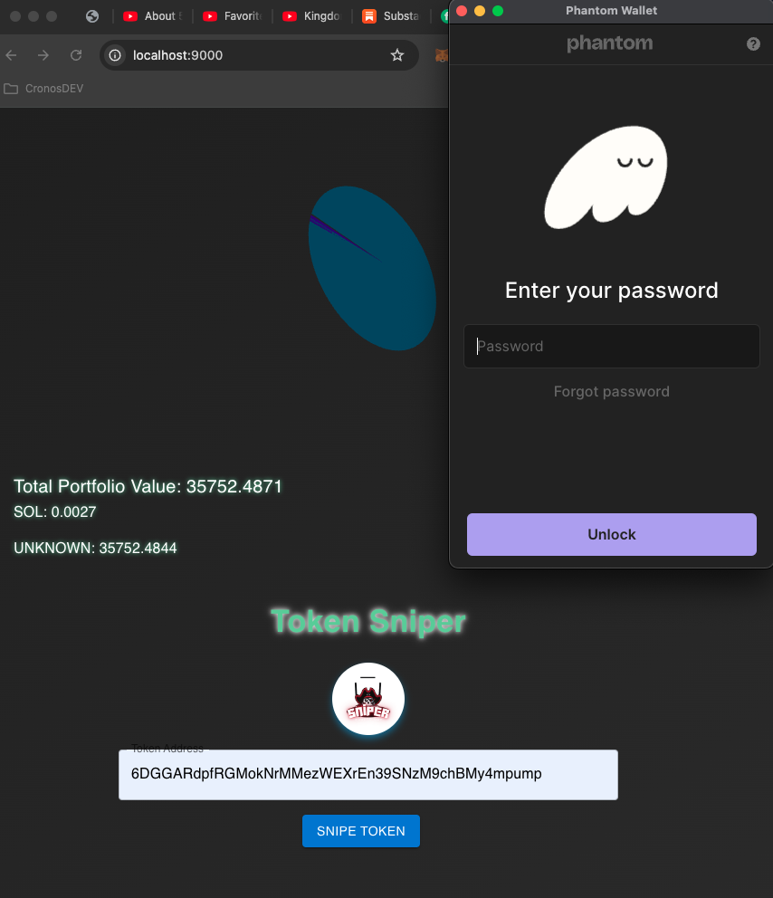
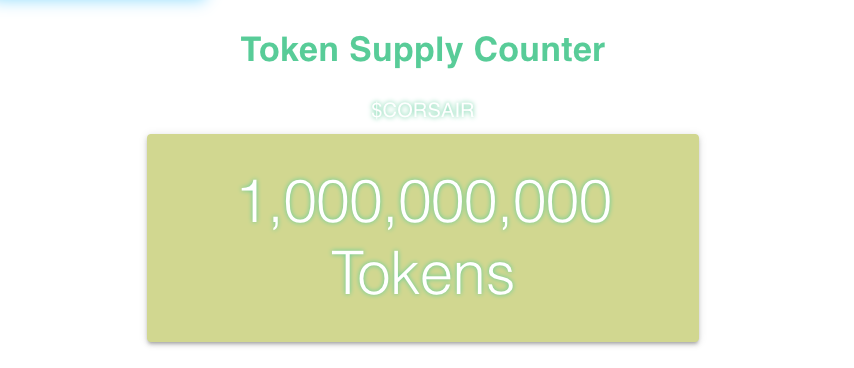

# Solana test app 


## Description
a work in progress setting the foundation for other apps on solana.

## Solana Network Libraries 
@solana/web3.js
@solana/wallet-adapter-base 
@solana/wallet-adapter-react 
@solana/wallet-adapter-wallets 
@solana/wallet-adapter-react-ui 
@solana/wallet-adapter-phantom
@solana/web3.js

## Additional Notes 
Network Configuration: You can switch between the Solana mainnet and devnet for testing purposes by adjusting the network URL in the configuration


## Solana Integration and Unit Testing
### Solana Integration
This project demonstrates integration with the Solana blockchain, enabling wallet connections, transaction handling, and data retrieval using the Solana Web3.js library and SPL Token utilities. The following features are implemented:

Wallet Connection: Users can connect their Solana wallets to interact with the blockchain.


Transaction Handling: The app facilitates sending transactions and interacting with token accounts.

Data Retrieval: Real-time data fetching from the Solana network, including token supplies and account information.


### Key Libraries Used
@solana/web3.js: Official Solana JavaScript API for interacting with the blockchain.
@solana/spl-token: Utilities for interacting with the Solana Program Library (SPL) tokens.


### Solana Configuration
The app is configured to connect to the Solana mainnet using an API service. Ensure that you set up the API key and endpoints correctly:
```
const API_URL = `https://solana-mainnet.g.alchemy.com/v2/${API_KEY}`;
const headers = {
  'Content-Type': 'application/json',
  'Authorization': `Bearer ${API_KEY}`,
};

```
Replace API_KEY with your actual API key from a Solana API provider, such as Alchemy or Helium/Quicknode.


## Unit Testing
Unit tests are implemented using Jest and React Testing Library to ensure the reliability and correctness of individual components and logic within the application.

### Key Testing Libraries
Jest: A JavaScript testing framework used to run tests and provide utilities for creating test suites.

React Testing Library: A library for testing React components with a focus on user interactions and behavior.

### Testing Setup
To set up the testing environment, ensure you have installed the necessary dependencies:
npm install --save-dev @testing-library/react @testing-library/jest-dom jest

### Test Files
App.test.js: Contains tests for the main application component, verifying rendering logic and interactions

### Running Unit Tests
To execute the unit tests, use the following command
`npm test`

This command runs all tests and outputs the results in the terminal, showing which tests passed or failed.

### Test Coverage
Rendering Logic: Tests ensure that all components render correctly based on different application states (e.g., wallet connected, loading, error).

User Interactions: Simulates user actions like clicking buttons and entering text to verify the app's response.

Mocked Blockchain Interactions: Tests mock Solana network interactions to ensure the application logic handles API calls and responses correctly without needing an actual blockchain connection.


## NODE FOR SOLANA
Alchemy 
https://dashboard.alchemy.com/products/node-api

https://solana-devnet.g.alchemy.com/v2/
https://solana-mainnet.g.alchemy.com/v2/[API SECRET]


## Other Resources
Solana API Endpoints 
https://docs.alchemy.com/reference/solana-api-endpoints

Solana Quickstart Guide 
https://docs.alchemy.com/reference/solana-api-quickstart

Alchemy Node API - write data to the blockchain 
https://dashboard.alchemy.com/products/node-api

Solscan
https://solscan.io/apis
https://public-api.solscan.io/docs/#/
https://pro-api.solscan.io/pro-api-docs/v2.0/reference/block-last

### Examples of Outputs: 
###
Here is an exxample of how the supply is returned to us: 


```
{
  "jsonrpc": "2.0",
  "result": {
    "context": {
      "apiVersion": "1.18.18",
      "slot": 281542389
    },
    "value": {
      "circulating": 465476284365400600,
      "nonCirculating": 116019818075693970,
      "nonCirculatingAccounts": [
        "GL7uXybnSKcq4dbrksGJursw9fAm8jA76ZeXQRNpRMqd",
        "Bu9DLx9ftgBzVBzLhMBXJYqJqYkYX6KDQFFMHbEGQ4c1",
        "2Hnv39uYe4TxCe5Ut6UDiMLAYqZkeDhjn9hGDVyF9eGw",
        "8jvWVRseiF9WrhX6YMLvBqTvEMK83cQPjet46jAUYUcJ",
        "CvgihzdzMRwfdAXkE3imwM6GVTUgSDCh7eSWK7wQygRu",
        "5Zq4v
```

getTokenSupply
```
{
    "jsonrpc": "2.0",
    "result": {
        "context": {
            "slot": 137571639
        },
        "value": {
            "amount": "999999999997060679",
            "decimals": 9,
            "uiAmount": 9.999999999970608E8,
            "uiAmountString": "999999999.997060679"
        }
    },
    "id": 1
}
```


## Alchemy Endpoints 

getBalance
Returns the balance of the account of provided Pubkey.
https://docs.alchemy.com/reference/getbalance

getProgramAccounts - PAID ONLY
Returns all accounts owned by the provided program Pubkey.
https://docs.alchemy.com/reference/getprogramaccounts

getTokenAccountBalance
Returns the token balance of an SPL Token account..
https://docs.alchemy.com/reference/gettokenaccountbalance
```
Response: {
    "jsonrpc": "2.0",
    "result": {
        "context": {
            "slot": 137567036
        },
        "value": {
            "amount": "301922375078",
            "decimals": 6,
            "uiAmount": 301922.375078,
            "uiAmountString": "301922.375078"
        }
    },
    "id": "017a141e-9a15-4ce3-b039-865e7dc7da00"
}
```


# What's Next: 
## Sending Transactions with Solana CLI
The Solana Command-Line Interface (CLI) provides a robust way to interact with the Solana blockchain.

## Transaction Signing and Sending:

The standard way of sending transactions on Solana is to sign a transaction locally using a wallet, serialize it, and then send it to the Solana cluster.